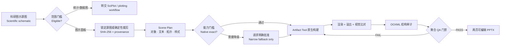

<div align="center">

# SciDiagram PPTX｜科研图示原生复现

**把科研框架、机制与流程图，高保真重建为 PowerPoint 原生可编辑对象。**<br>
*Scientific schematics in. Native editable PowerPoint out.*

<p>
  <a href="https://github.com/SciToolsmith/sci-diagram-pptx/actions/workflows/validate.yml"></a>
  <a href="LICENSE"></a>
  <a href="skills/sci-diagram-pptx/SKILL.md"></a>
  
  
</p>


<a href="#install"><strong>安装</strong></a>
·
<a href="#scope"><strong>适用边界</strong></a>
·
<a href="#delivery"><strong>两页交付</strong></a>
·
<a href="#workflow"><strong>工作流</strong></a>
·
<a href="#qa"><strong>审计与 QA</strong></a>
·
<a href="#examples"><strong>调用示例</strong></a>
·
<a href="#english"><strong>English</strong></a>

</div>

> [!IMPORTANT]
> **科研图示不等于科研数据图。** SciDiagram PPTX 面向由节点、容器、标签、公式和连接关系承载含义的学术图示；柱状图、折线图、散点图、小提琴图、热图等由坐标轴、尺度或数据驱动几何承载证据的图件，应交给 [SciPlot](https://github.com/SciToolsmith/sci-plot) 或其他科学绘图工作流。

SciDiagram PPTX 是由 **SciToolsmith** 维护的 Codex Agent Skill。它把“图片放进 PPT”升级为一条可检查的原生重建链：

```text
锁定源图 → 建立 Scene Plan → 原生对象重建 → 渲染比对 → OOXML 审计 → 聚合门禁 → 交付 PPTX
```

普通文字保持为文字，节点保持为形状，关系保持为连接线。整个图不会被一张位图、导入 SVG 或文字轮廓伪装成“可编辑”。

| **2** 页固定交付 | **8** 道 QA 门 | **8** 个确定性核心工具 | **3** 条任务路线 |
|:---:|:---:|:---:|:---:|
| 原生重建 + 锁定原图 | 从目标确认到偏差审计 | 预检、规划、渲染、比对与审计 | Create · Repair · Audit |

<a id="scope"></a>

## 适用边界

### 适合使用

- 研究框架图、理论框架图与技术路线图；
- 科研流程图、机制图与算法流程图；
- 科研系统结构图、学术概念模型与结构化科研信息图；
- 由节点、箭头、嵌套区域和明确拓扑关系组成的图示；
- 含中英文标签、希腊字母、数学符号或公式的学术图示；
- 混合论文图中，由用户**明确选定**的科研图示面板。

### 不适合使用

| 不适用目标 | 原因 / 建议工作流 |
|---|---|
| 柱状图、折线图、散点图、箱线图、小提琴图、热图、森林图、火山图等 | 其主要证据由数据、坐标轴、尺度或统计编码决定；使用 [SciPlot](https://github.com/SciToolsmith/sci-plot) 或代码绘图 |
| 通用商业流程、组织架构、商业信息图 | 超出科研图示复现契约；使用通用演示文稿或制图工作流 |
| 根据文字从零设计一张全新机制图 | 本 Skill 的默认任务是忠实复现，不是重新设计 |
| OCR、翻译、照片修复或简单把图片放入 PPT | 这些任务不需要原生结构重建工作流 |
| 没有权威源图的 Repair / Audit | 无法建立保真依据；返回 `NEEDS_SOURCE` |

判定规则很简单：**主要含义来自节点、标签、区域与关系，就可能适用；主要含义来自坐标轴、尺度、图例与数据驱动几何，就不适用。**

对于包含图示、统计图、显微图或照片的多面板论文图，Skill 只处理用户明确选定的图示面板。确定性裁剪工具会记录父图哈希、显示像素坐标、裁剪哈希和用户选择来源；不会凭视觉显著性替用户猜目标。

<a id="delivery"></a>

## 固定的两页交付契约

每次合格交付都恰好包含两页，并使用同一画布尺寸：

| 页面 | 内容 | 目的 |
|---|---|---|
| **Slide 1** | 由 PowerPoint 原生形状、文字、连接线和经批准的局部例外组成的重建图 | 直接编辑节点、标签、颜色、连接关系和布局 |
| **Slide 2** | 未重绘的锁定源图，或用户明确选定的精确面板裁剪 | 提供可追溯的视觉基准，便于逐项核验 |

Slide 1 不允许出现整页源图、隐藏描摹图、图片拼块、导入 SVG 路径云、轮廓化文字或伪造的页底矩形。Slide 2 保持源图宽高比，居中完整放置，不再二次裁剪。

### 原创合成示例

下面的合成图仅用于说明交付形态，不来自论文或第三方素材。左侧是锁定源图，右侧是同一结构的原生 PowerPoint 重建；可下载两页示例文件检查对象编辑性。

<table role="presentation">
  <tr>
    <th width="50%">Locked synthetic source</th>
    <th width="50%">Native reconstruction</th>
  </tr>
  <tr>
    <td></td>
    <td></td>
  </tr>
</table>

<p align="center"><a href="examples/synthetic-demo.pptx"><strong>下载两页原生可编辑示例 PPTX</strong></a></p>

> [!NOTE]
> “原生可编辑”不等于“所有能力都一定无损”。复杂自由曲线、真竖排、深层公式或特殊箭头会先经过运行时能力探测；语义相关的近似或栅格回退必须得到用户明确批准，不能静默降级。

<a id="install"></a>

## 安装

在 Codex 中粘贴：

```text
请使用 $skill-installer 安装：
https://github.com/SciToolsmith/sci-diagram-pptx/tree/main/skills/sci-diagram-pptx
```

安装后使用 `$sci-diagram-pptx` 显式调用。Codex 通常会自动发现新 Skill；如果没有出现，请重启 Codex。

<details>
<summary><strong>手动安装 / Manual installation</strong></summary>

```bash
git clone https://github.com/SciToolsmith/sci-diagram-pptx.git
mkdir -p "${CODEX_HOME:-$HOME/.codex}/skills"
cp -R sci-diagram-pptx/skills/sci-diagram-pptx \
  "${CODEX_HOME:-$HOME/.codex}/skills/sci-diagram-pptx"
```

也可以复制到当前项目的 `.agents/skills/sci-diagram-pptx/`，使它仅在该仓库范围内生效。

Skill 的目录结构与安装原理可参阅 OpenAI 官方的 [Build skills](https://developers.openai.com/plugins/build/skills) 文档。

</details>

普通使用者不需要单独配置 PPTX 生成库。Skill 会调用当前 Codex 环境中的 `Presentations` 工作流，并使用其提供的 Artifact Tool、渲染器和检查工具。若当前环境缺少必要能力，Skill 应停止并明确报告，而不是换用不受支持的作者工具。

<a id="examples"></a>

## 调用示例

| 目标 | 可以直接交给 Codex 的提示 |
|---|---|
| **创建原生复现** | `$sci-diagram-pptx 把这张研究框架图忠实重建为原生可编辑 PPTX，不要美化或改写内容。` |
| **处理混合论文图** | `$sci-diagram-pptx 只复现我标出的 panel B；相邻的统计图和显微图不要处理。` |
| **修复现有文件** | `$sci-diagram-pptx 以这张锁定原图为准，修复现有 PPTX 中错位、错误连线和不可编辑对象，保留已经正确的原生元素。` |
| **只读审计** | `$sci-diagram-pptx 对照原图审计这个 PPTX 的内容、拓扑、原生可编辑性和视觉保真度；先不要修改。` |
| **含公式图示** | `$sci-diagram-pptx 复现这张算法流程图。先核对公式和上下标；如果 Office Math 不能可靠往返，请在降级前征求我确认。` |

Skill 支持三条任务路线：

- **Create**：有权威源图，但尚无可编辑复现；
- **Repair**：有锁定源图和现有 PPTX，保留正确对象并修复差异；
- **Audit**：有锁定源图和现有 PPTX，只读检查、不修改文件。

如果用户要求重新设计、扩写内容或从文本创作新图，Skill 会停止复现路线，交给通用演示文稿工作流。

<a id="workflow"></a>

## 工作流



### 1. 锁定源图，而不是依赖文件名

预检会记录源文件 SHA-256、像素尺寸、格式、EXIF 方向、透明通道和宽高比。混合图的裁剪会额外绑定父图与用户选区，避免换图、错图或过期裁剪混入后续流程。

### 2. 先建立 Scene Plan，再写 PPTX

每个对象与连接关系拥有稳定 ID、源图坐标、幻灯片坐标、文字内容、样式、层级、预期 OOXML 类型和置信度。缺少关键字段、对象 ID 重复、连接端点不存在、低置信度内容或未经批准的降级都会被验证器拒绝。

### 3. 以语义单元重建

- 一个带标签的节点优先使用一个含原生文字的形状；
- 一条关系优先使用一个原生连接线，而不是线段和箭头拼装；
- 连续文字保持为连续文字，不按字符拆碎；
- 只有本质上不可矢量化的局部内容，才可能在明确批准后保留为局部栅格对象。

### 4. 每次导出都重新渲染

渲染证据绑定最终 PPTX 哈希与每页 PNG 哈希，防止使用旧预览。视觉差异、空白页、异常平移、前景遗漏、字体变化和连接线问题都会进入 QA，而不是只检查“文件能否生成”。

### 5. 审计实际 PPTX 包

结构审计直接检查 OOXML/ZIP 证据：页数、尺寸、对象类型、文字、形状几何、连接语义、栅格对象、参考页源图、外部媒体、宏、OLE、SVG/EMF/WMF 捷径和孤立部件。

<a id="qa"></a>

## 审计与 QA

SciDiagram PPTX 把交付判断建立在一条哈希绑定的证据链上：

```text
source SHA
  → panel manifest SHA（如适用）
  → scene plan SHA
  → final PPTX SHA
  → rendered-slide SHA
  → overflow / visual / OOXML reports
  → manual review attestation
  → qa-summary.json: delivery_authorization = true
```

八道 QA 门分别覆盖：

1. **目标与契约**：范围、源图、选区、页数和画布一致；
2. **结构保真**：节点、区域、层级、连接方向与拓扑完整；
3. **内容与字体**：文字、符号、公式、换行、字体回退和溢出正确；
4. **原生可编辑性**：文字仍是文字、形状仍是形状、关系仍是连接线；
5. **背景与参考页**：重建页不藏源图，参考页精确绑定源图；
6. **视觉比对**：逐页全尺寸检查，并使用差分证据定位问题；
7. **导出完整性**：文件可打开、部件完整、无临时路径和调试对象；
8. **偏差审计**：所有语义相关近似都有范围明确的用户批准。

任何硬失败都会阻止交付。单一像素相似度、脚本零退出码或“能打开文件”都不能单独授权交付。

### 当前代码快照的验证记录

| 验证面 | 结果 | 说明 |
|---|---:|---|
| 内置预检、Schema、裁剪与来源链回归 | **27 / 27 PASS** | 使用合成 fixture，覆盖 EXIF 方向、精确像素裁剪、越界与错误来源链 |
| PPTX 审计、视觉防空白与聚合门禁回归 | **12 / 12 PASS** | 覆盖整页图片、裁剪参考页、形状几何、公式语义和报告绑定等失败模式 |
| 四类真实世界科研图示的只读预检 | **45 / 45 PASS** | 覆盖密集中文路线、灰度框架、公式算法流程和数学机制拓扑；源图不随仓库分发 |
| 代表性原生重建端到端验证 | **113 / 113 PASS** | Scene Plan、渲染、溢出、视觉、OOXML 与聚合门禁全部通过，`delivery_authorization: true` |

这些数字是当前代码快照的工程回归记录，不是对任意论文图的准确率基准，也不替代研究者对文字、公式和科学含义的最终核验。

Skill 只在证据允许时使用两个验证标签：

- `renderer-verified`：OOXML、标准渲染、溢出和视觉检查已通过，但没有 Microsoft PowerPoint 往返证据；
- `powerpoint-verified`：另经 Microsoft PowerPoint 打开、保存、渲染并完成代表性编辑冒烟测试。

LibreOffice、缩略图渲染或 ZIP 检查不能冒充 `powerpoint-verified`。

## 诚实处理不确定性

Skill 不会猜测会改变含义的模糊内容。遇到以下情况时，它会返回明确状态，而不是生成一个“看起来完成”的文件：

```text
NEEDS_TARGET_SELECTION
NEEDS_SOURCE
NEEDS_CONTENT_CONFIRMATION
NEEDS_FALLBACK_APPROVAL
UNSUPPORTED_NATIVE_REQUIREMENT
QA_NOT_CONVERGING
DELIVERED
```

复杂公式尤其遵循“语义正确 → 原生可编辑 → 排版可读 → 位置相似 → 像素相似”的优先级。只有经过能力探测并能安全往返时，才承诺 Office Math；否则先说明线性文本、Unicode、模板原生公式或局部图像的代价，再等待用户选择。

## 项目结构

```text
.
├── README.md
├── LICENSE
├── requirements-ci.txt
├── .github/workflows/validate.yml
├── docs/
│   ├── hero.svg                       # 原创项目概念图，不含论文截图
│   ├── synthetic-source.png           # 原创合成源图
│   └── synthetic-native.png           # 原生重建渲染
├── examples/
│   └── synthetic-demo.pptx            # 两页合成示例
├── tests/
│   ├── test_preflight.py              # 来源链与场景契约回归
│   └── test_audit.py                  # OOXML、视觉与聚合门禁回归
└── skills/sci-diagram-pptx/
    ├── LICENSE                        # 随 Skill 子目录单独分发
    ├── SKILL.md                       # 触发边界、固定流程与交付契约
    ├── agents/openai.yaml             # Codex UI 元数据
    ├── references/
    │   ├── reconstruction-contract.md # 保真与两页交付契约
    │   ├── native-object-policy.md    # 原生对象和栅格边界
    │   ├── math-and-fonts.md          # 公式、字体与降级原则
    │   ├── capability-matrix.md       # Artifact Tool 能力探测
    │   ├── qa-gates.md                # 八道 QA 门
    │   └── scene-plan.example.json
    └── scripts/
        ├── source_preflight.py        # 源图身份与图像属性清单
        ├── panel_crop.py              # 确定性选区裁剪与来源清单
        ├── validate_scene_plan.py     # Schema、语义和来源链校验
        ├── render_evidence.py         # PPTX/渲染结果哈希绑定
        ├── compare_render.py          # 视觉差异与防空白检查
        ├── overflow_check.py          # 溢出检查封装
        ├── audit_pptx.py              # ZIP/XML 原生结构审计
        └── qa_gate.py                 # 失败即关闭的聚合交付门禁
```

### 维护者本地验证

在 Python 3.10+ 环境安装 `requirements-ci.txt` 后运行：

```bash
python3 tests/test_preflight.py --expect-count 0
python3 tests/test_audit.py -q
```

普通 Skill 使用不要求手动运行测试；Codex 工作流会使用当前工作区解析出的依赖运行时，而不是假设系统 Python 已配置完毕。

## 参与建设

欢迎通过 [Issues](https://github.com/SciToolsmith/sci-diagram-pptx/issues) 或 Pull Requests 贡献：

- 新的科研图示结构、字体、公式或连接线兼容性探针；
- 能揭示错误交付的最小合成 fixture 与 QA 回归；
- Artifact Tool 或不同 PowerPoint 版本的往返证据；
- 中英文文档、可访问性和错误提示改进；
- 对 Scene Plan、OOXML 审计和来源链的可验证增强。

请不要提交来源不明的论文截图、期刊素材、受限数据或第三方图形资产。用于测试和文档的视觉示例应为原创合成素材，或附带明确允许再分发的许可和来源记录。

## 许可、隐私与声明

本项目以 [Apache License 2.0](LICENSE) 发布。

- 仓库不包含、也不会随 Skill 分发开发过程中用于只读验证的论文截图；
- 用户提供的源图是当前任务的视觉与内容依据，使用者仍需确认其处理和再利用权限；
- `BUILD_DIR` 中的 QA 报告可能包含本地绝对路径、文件哈希和源图 EXIF 元数据；默认应留在本地，公开前必须检查和脱敏；
- 生成后的文字、公式、方向、连接关系与科学含义必须由研究者最终核验；
- Apache-2.0 仅覆盖本仓库原创代码与文档，不自动覆盖外部依赖、用户输入或生成文件中的第三方内容；
- SciDiagram PPTX 是独立社区项目，与 OpenAI、Microsoft、Nature、Springer Nature 或任何期刊没有隶属或官方合作关系。

设计过程中参考了开源 Agent Skill 社区在渐进式披露、能力探测和科研工作流方面的实践，包括 [nature-skills](https://github.com/Yuan1z0825/nature-skills) 与 [academic-figure-skill](https://github.com/TingxiYu/academic-figure-skill)。本仓库未复制或再分发其文件，也不代表与这些项目存在合作关系。

<a id="english"></a>

<details>
<summary><strong>English quick start</strong></summary>

### What it does

SciDiagram PPTX is a Codex Agent Skill maintained by **SciToolsmith**. It reconstructs a user-supplied scientific or academic schematic as native editable PowerPoint shapes, text, and connectors, then verifies the exported package through hash-bound render, overflow, visual, OOXML, and manual-review evidence.

It is designed for research frameworks, technical routes, mechanism diagrams, algorithm flows, scientific system architectures, conceptual models, structured scientific infographics, and formula-bearing academic schematics.

It is **not** a statistical plotting skill. Bar, line, scatter, box, violin, heat-map, forest, volcano, and similar data-driven visuals belong in [SciPlot](https://github.com/SciToolsmith/sci-plot) or another plotting workflow. It is also not a general business-diagram, OCR, photo-editing, or slide-design tool.

### Install

Ask Codex to install:

```text
Use $skill-installer to install:
https://github.com/SciToolsmith/sci-diagram-pptx/tree/main/skills/sci-diagram-pptx
```

Then invoke it with `$sci-diagram-pptx`.

### Example

```text
$sci-diagram-pptx Reconstruct this scientific mechanism diagram as a
high-fidelity native editable PPTX. Preserve the wording and topology;
do not redesign it. Ask before applying any semantic approximation.
```

### Delivery contract

Every successful reconstruction contains exactly two slides:

1. a native editable reconstruction;
2. the locked source image or exact user-selected schematic-panel crop.

Delivery is fail-closed. The aggregate gate must bind the source, scene plan, final PPTX, fresh renders, overflow report, visual comparison, OOXML audit, and full-size manual review before it can report `delivery_authorization: true`.

</details>
