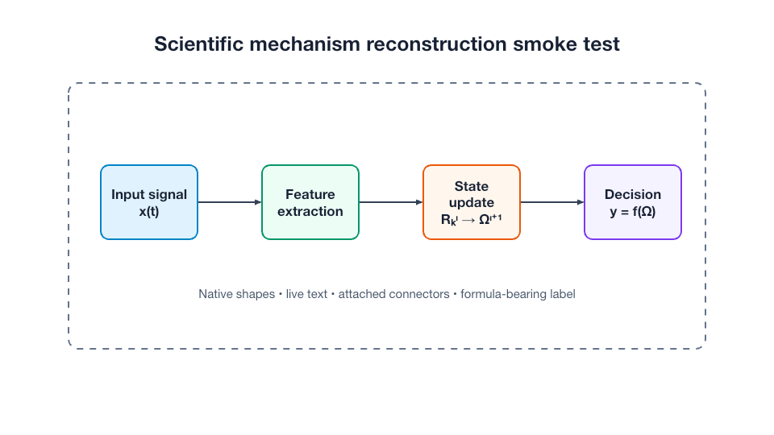
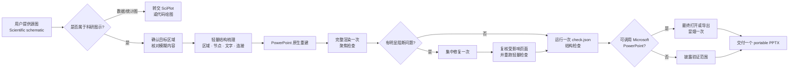

<div align="center">

# SciDiagram PPTX｜科研图示原生复现

**把科研框架、机制与流程图，重建为 PowerPoint 原生可编辑对象。**<br>
*Scientific schematics in. Native editable PowerPoint out.*

<p>
  <a href="https://github.com/SciToolsmith/sci-diagram-pptx/actions/workflows/validate.yml"></a>
  <a href="LICENSE"></a>
  <a href="skills/sci-diagram-pptx/SKILL.md"></a>
  
  
</p>


<a href="#install"><strong>安装</strong></a>
·
<a href="#scope"><strong>适用边界</strong></a>
·
<a href="#delivery"><strong>交付内容</strong></a>
·
<a href="#compatibility"><strong>跨平台兼容</strong></a>
·
<a href="#workflow"><strong>工作流</strong></a>
·
<a href="#qa"><strong>质量检查</strong></a>
·
<a href="#examples"><strong>调用示例</strong></a>
·
<a href="#english"><strong>English</strong></a>

</div>

> [!IMPORTANT]
> **科研图示不等于科研数据图。** SciDiagram PPTX 面向由节点、容器、标签、公式和连接关系承载含义的学术图示；柱状图、折线图、散点图、小提琴图、热图等由坐标轴、尺度或数据驱动几何承载证据的图件，应交给 [SciPlot](https://github.com/SciToolsmith/sci-plot) 或其他科学绘图工作流。

SciDiagram PPTX 是由 **SciToolsmith** 维护的 Codex Agent Skill。它不会把整张图片塞进 PPT 来伪装“可编辑”，而是尽量让文字仍是文字、节点仍是形状、关系仍是连接线：

```text
确认目标 → 梳理内容与拓扑 → 原生对象重建 → 渲染检查 → 必要时集中修复一次 → 交付
```

它采用一条适度的质量控制流程：对文字、公式、连接关系、原生可编辑性和文件完整性保持严格；对抗锯齿、轻微色差、字体度量和几个像素的间距差异保持务实。目标不是追逐一个像素分数，而是交付一份**内容可靠、结构正确、真正可编辑且整体接近源图**的 PPTX。

| 原生可编辑 | 科学含义优先 | 聚焦式检查 | 默认两页对照 |
|:---:|:---:|:---:|:---:|
| 形状、文字与连接线 | 文字、公式、方向与拓扑 | 一次完整渲染，最多一轮集中修复 | 重建页 + 源图页 |

<a id="scope"></a>

## 适用边界

### 适合使用

- 研究框架图、理论框架图与技术路线图；
- 科研流程图、机制图与算法流程图；
- 科研系统结构图、学术概念模型与结构化科研信息图；
- 由节点、箭头、嵌套区域和明确拓扑关系组成的图示；
- 含中英文标签、希腊字母、数学符号或公式的学术图示；
- 混合论文图中，由用户**明确选定**的科研图示面板；
- 已有可编辑 PPTX 的对照修复或只读检查。

### 不适合使用

| 不适用目标 | 原因 / 建议工作流 |
|---|---|
| 柱状图、折线图、散点图、箱线图、小提琴图、热图、森林图、火山图等 | 主要证据由数据、坐标轴、尺度或统计编码决定；使用 [SciPlot](https://github.com/SciToolsmith/sci-plot) 或代码绘图 |
| 通用商业流程、组织架构与商业信息图 | 使用通用演示文稿或制图工作流更合适 |
| 根据文字从零设计一张全新机制图 | 本 Skill 的默认目标是忠实复现，不是重新设计 |
| OCR、翻译、照片修复或简单把图片放入 PPT | 这些任务不需要原生结构重建 |
| 缺少权威源图的对照修复或保真审查 | 没有可靠基准，无法判断内容和结构是否忠实 |

判定方法很简单：**主要含义来自节点、标签、区域与关系，就可能适用；主要含义来自坐标轴、尺度、图例与数据驱动几何，就不适用。**

对于同时包含图示、统计图、显微图或照片的多面板图片，Skill 只处理用户明确选定的图示面板，不凭视觉显著性替用户猜目标。

<a id="delivery"></a>

## 交付内容

创建或重建任务默认交付**一个跨平台可编辑 PPTX**（portable editable PPTX）。文件内包含两页，并保持同一画布尺寸：

| 页面 | 内容 | 用途 |
|---|---|---|
| **Slide 1** | 由 PowerPoint 原生形状、文字、连接线和必要的局部例外组成的重建图 | 直接编辑节点、标签、颜色、连接关系和布局 |
| **Slide 2** | 未重绘的源图，或用户明确选定的图示面板 | 提供视觉基准，方便研究者对照和后续微调 |

Slide 1 不使用整页截图、图片拼块、导入 SVG 路径云或轮廓化文字来伪装原生可编辑。只有无法合理表示为 PowerPoint 原生对象的局部内容，才会说明限制并在得到用户确认后采用局部替代方案。

Slide 2 保持源图宽高比并完整放置；如果用户选定的是混合图中的某个面板，则使用该明确选区。

### 原创合成示例

下面的合成图仅用于说明交付形态，不来自论文或第三方素材。左侧是源图，右侧是同一结构的原生 PowerPoint 重建；可以下载示例文件检查对象编辑性。

<table role="presentation">
  <tr>
    <th width="50%">Synthetic source</th>
    <th width="50%">Native reconstruction</th>
  </tr>
  <tr>
    <td></td>
    <td></td>
  </tr>
</table>

<p align="center"><a href="examples/synthetic-demo.pptx"><strong>下载两页原生可编辑示例 PPTX</strong></a></p>

> [!NOTE]
> “原生可编辑”不等于所有复杂对象都能无损往返。复杂自由曲线、真竖排、深层公式和特殊箭头可能受到 PowerPoint 或当前生成工具能力限制。Skill 会优先保护科学含义和可编辑性，并在语义相关的近似或局部栅格替代前征求确认。

<a id="compatibility"></a>

## 跨平台兼容策略

SciDiagram PPTX 默认只生成一个 portable editable PPTX，不默认拆成 Windows 版和 macOS 版。兼容目标是让科学内容、拓扑、原生可编辑性和可读性在常见 PowerPoint 环境中保持稳定；**不承诺不同操作系统、PowerPoint 版本和字体环境下像素完全一致**。

为减少跨平台重排，Skill 在生成阶段采用 PowerPoint 支持较稳定的对象和显式排版参数：

- 标准矩形、圆形、箭头等 preset shape 可以直接承载文字；自定义几何和自由形状默认只作为视觉底板，文字覆盖为独立的标准 PowerPoint 文本框。只有已明确设置文字矩形并通过聚焦渲染验证的自定义几何才直接承载文字；
- 显式设置字体、字号、换行、内边距和对齐，并按文字实测尺寸留出合理余量（通常约一成，按文字和语言调整），不依赖文件打开后的 AutoFit 重新决定版式；
- 优先选择字形覆盖完整、目标环境较稳定的字体；无法避免字体替换、回退或换行变化时，在交付说明中披露，而不声称已经跨平台等效；
- 简单上下标优先使用原生 baseline / structured runs；复杂公式优先使用经当前工具验证的 Office Math。任何可能改变公式含义的线性文本或局部图片替代都需要先确认。

只有在 portable 规则仍无法消除影响内容或阅读的**真实平台阻断问题**时，才从同一份规范对象数据派生平台专用文件；每个副本都必须在对应目标平台完成验证。仅在当前系统生成一个带平台名称的副本，不算对应平台已验证。

如果需求是固定展示效果而不是跨平台继续编辑，优先在单一可编辑 PPTX 之外提供 PDF 预览，而不是自动维护两份未经实机验证的 PPTX。

常规验证保持克制：一次完整渲染、一次 `check.json` 结构检查；如发现阻断问题，集中修复并复核受影响页面。当前环境可以调用 Microsoft PowerPoint 时，再做一次最终打开或导出冒烟检查；不可用时，交付说明会明确验证范围，不以 LibreOffice、CI 或 OOXML 检查代替原生 PowerPoint 验证。

<a id="install"></a>

## 安装

在 Codex 中粘贴：

```text
请使用 $skill-installer 安装：
https://github.com/SciToolsmith/sci-diagram-pptx/tree/main/skills/sci-diagram-pptx
```

安装后使用 `$sci-diagram-pptx` 显式调用。Codex 通常会自动发现新 Skill；如果没有出现，请重启 Codex。

<details>
<summary><strong>手动安装 / Manual installation</strong></summary>

```bash
git clone https://github.com/SciToolsmith/sci-diagram-pptx.git
mkdir -p "${CODEX_HOME:-$HOME/.codex}/skills"
cp -R sci-diagram-pptx/skills/sci-diagram-pptx \
  "${CODEX_HOME:-$HOME/.codex}/skills/sci-diagram-pptx"
```

也可以复制到当前项目的 `.agents/skills/sci-diagram-pptx/`，使它仅在该仓库范围内生效。

Skill 的目录结构与安装原理可参阅 OpenAI 官方的 [Build skills](https://developers.openai.com/plugins/build/skills) 文档。

</details>

普通使用者不需要单独配置 PPTX 生成库。Skill 会调用当前 Codex 环境中的 `Presentations` 工作流及其 PowerPoint 生成、渲染与检查能力。如果当前环境缺少必要能力，Skill 会明确报告限制，不会静默改用整页图片作为替代。

<a id="examples"></a>

## 调用示例

| 目标 | 可以直接交给 Codex 的提示 |
|---|---|
| **创建原生复现** | `$sci-diagram-pptx 把这张研究框架图忠实重建为原生可编辑 PPTX，不要美化或改写内容。` |
| **处理混合论文图** | `$sci-diagram-pptx 只复现我标出的 panel B；相邻的统计图和显微图不要处理。` |
| **修复现有文件** | `$sci-diagram-pptx 以这张原图为准，修复现有 PPTX 中的错位、错误连线和不可编辑对象，保留已经正确的原生元素。` |
| **只读检查** | `$sci-diagram-pptx 对照原图检查这个 PPTX 的文字、拓扑、原生可编辑性和明显布局问题；先不要修改。` |
| **含公式图示** | `$sci-diagram-pptx 复现这张算法流程图。先核对公式和上下标；如果不能可靠原生表示，请在替代前征求我确认。` |

创建、修复和只读检查只是不同的用户目标，不是三套质量模式；它们遵循同一套内容优先、原生重建和聚焦验证原则。

<a id="workflow"></a>

## 工作流



### 1. 确认目标和内容

- 判断输入是否属于科研图示，而不是数据驱动图表；
- 混合图只处理用户明确选定的面板；
- 核对文字、公式、上下标和箭头方向；
- 对会改变含义且无法可靠辨认的内容，向用户确认，不凭猜测补全。

### 2. 做轻量结构梳理

识别主要区域、节点、标签、层级、阅读顺序和连接关系，并直接服务于 PowerPoint 构建。它可以是代码中的对象清单或简洁笔记，不要求为每次任务额外生成完整 Scene Plan、逐对象置信度文件或重复的 JSON 契约。

### 3. 用语义单元原生重建

- 带标签的节点优先使用含原生文字的形状；
- 自定义几何和自由形状默认作为视觉底板，文字使用独立标准文本框覆盖；
- 关系优先使用原生连接线，并保持箭头方向和端点语义；
- 连续文字保持为连续文字，不按字符拆碎；
- 在生成期明确字体、换行和内边距并预留排版余量，不依赖打开后的动态 AutoFit；
- 保留源图的信息层级和阅读路径，不擅自改写或美化；
- 只有遇到复杂公式、特殊曲线或不确定的生成能力时，才按需查阅能力和字体参考。

### 4. 完整渲染一次，检查真正重要的差异

生成后进行一次完整渲染，结合源图检查：

- 文字、符号、公式和换行是否正确；
- 节点、分组、层级、箭头方向和拓扑是否完整；
- 第一页是否主要由原生形状、文字和连接线构成；
- 是否存在明显遮挡、裁切、溢出或页面异常；
- 整体比例、布局、颜色和视觉层级是否接近源图。

渲染比对用于发现问题，不使用单一像素相似度决定是否可以交付。

### 5. 最多进行一轮集中修复

如果检查发现会影响内容、结构、可编辑性或阅读的明显问题，先汇总，再集中修复一次，并复核受影响页面。不会为了抗锯齿、轻微色差或几个像素的偏移反复重建。

如果集中修复后仍存在会改变科学含义或破坏文件的阻断问题，Skill 会说明具体限制并请求用户确认，而不是把未解决的问题包装成完成，也不会进入无上限优化循环。

完成初次渲染和必要的集中修复后，对最终候选运行一次 `check.json` 结构检查。检查器报告的硬失败必须在交付前解决；结构检查不会重新开启一套多轮视觉审核。

### 6. 做一次最终原生冒烟并交付

当前环境可以调用 Microsoft PowerPoint 时，在所有修复完成后只做一次最终打开或导出冒烟检查。不可用时，不用替代渲染器冒充原生验证，而是在交付说明中准确列出已完成的渲染、结构检查和平台范围。

默认交付一个 portable editable PPTX，并用简短说明列出确实需要研究者核验的内容、已完成的验证以及可在 PowerPoint 中轻松调整的细节。临时预览和内部诊断文件不作为默认交付物。

<a id="qa"></a>

## 质量检查

SciDiagram PPTX 不把所有差异一视同仁。判断顺序是：

```text
科学含义 → 拓扑关系 → 原生可编辑性 → 可读性与文件完整性 → 视觉接近
```

### 必须解决后才能作为完成稿交付

- 关键文字、公式、符号或上下标错误、遗漏，或在不确定时被擅自猜测；
- 节点缺失、箭头方向错误、连接端点错误或阅读顺序被改变；
- 用整页图片、图片拼贴或轮廓化文字伪装原生可编辑；
- 明显遮挡、裁切、文字溢出、空白页或页面尺寸异常；
- PPTX 包损坏、无法读取，或包含不必要的宏、OLE、外链媒体；
- 未经确认、且可能改变科学含义的近似或局部栅格替代。

### 可以在不影响交付的情况下说明或留给 PowerPoint 微调

- 不同渲染器带来的抗锯齿和字体栅格化差异；
- 不影响含义和层级的轻微色差、线宽、圆角或阴影差异；
- 由字体度量造成的小范围换行或间距变化；
- 少量像素级位置偏差和不影响阅读的装饰细节。

如果上述“轻微差异”已经影响文字可读性、关系判断或科学含义，它就不再是可接受微差，必须进入集中修复。

### 单一轻量检查结果

主流程只保留一份简洁的结构检查结果，而不是要求 Scene Plan、来源清单、渲染报告、溢出报告、视觉报告、人工证明和聚合门禁相互绑定。

```bash
python skills/sci-diagram-pptx/scripts/check_pptx.py output.pptx \
  --source source.png \
  --output check.json
```

检查结果包含 `status`、`hard_failures`、`warnings` 和具体检查项，聚焦于：

- PPTX/ZIP 是否可读且至少包含一页；
- 两页交付时画布尺寸是否一致；
- 第一页是否包含原生形状、文字或连接线，且不存在近整页单图或大面积图片拼贴；
- 自定义几何对象出现时列入风险清单；直接承载文字却缺少 OOXML 文字矩形（`<a:rect>`）时作为硬失败；
- 字体、换行与 AutoFit 结构清单；隐式或主题占位字体、`wrap="none"` 和打开时动态 AutoFit 会提示风险，互斥 AutoFit 设置同时存在时作为硬失败；
- Office Math 结构是否为空，以及 Unicode 上下标/上标等可能发生字体回退的记号风险；
- 是否存在宏、OLE 或外链媒体；
- 提供源图且存在第二页时，参考页是否为唯一、未裁剪且与源图一致的嵌入图片。

这份结构检查不使用平台字体白名单，也不根据小文本框尺寸作脆弱推断。它不能判断字体在目标电脑上是否真实可用、公式与科学含义是否正确，也不能证明跨平台一致，更不能替代渲染后的视觉核对、真实 PowerPoint 冒烟检查或研究者最终确认。

## 验证说明

仓库 CI 用原创合成 fixture 验证 Skill 元数据、脚本可运行性、PPTX 包检查以及常见失败条件。维护者可以在 Python 3.10+ 环境安装 `requirements-ci.txt` 后运行：

```bash
python3 tests/test_panel_crop.py
python3 tests/test_check.py
```

这些回归测试证明的是当前代码路径能识别已覆盖的结构问题，不是任意科研图示的识别准确率或像素保真度基准。GitHub Actions、LibreOffice 渲染、ZIP/OOXML 检查也不能自动证明某个文件已经在 Microsoft PowerPoint 中完成往返测试；只有实际完成相应操作时，才应作出该说明。

每次交付都应区分并如实说明：已完成通用渲染、已通过 `check.json`、已在 Microsoft PowerPoint 打开或导出，以及实际验证的平台和版本。没有执行的层级不得由其他检查推断为已经通过。

## 诚实处理不确定性

Skill 不会猜测可能改变含义的模糊内容。常见情况包括：

- 未明确选定混合图中的目标面板；
- 源图分辨率不足，关键文字、公式或箭头无法判断；
- 当前工具不能可靠表达某种复杂公式、竖排文字或特殊几何；
- 一轮集中修复后仍存在影响语义或文件完整性的阻断问题。

遇到这些情况时，Skill 会指出具体问题并请求补充信息或批准范围明确的替代方案。复杂公式遵循“语义正确 → 原生可编辑 → 排版可读 → 位置相似”的优先级，不为了像素相似牺牲公式含义。

## 项目结构

```text
.
├── README.md
├── LICENSE
├── requirements-ci.txt
├── .github/workflows/validate.yml
├── docs/
│   ├── hero.svg                       # 原创项目 Hero
│   ├── synthetic-source.png           # 原创合成源图
│   └── synthetic-native.png           # 原生重建渲染
├── examples/
│   └── synthetic-demo.pptx            # 两页原生可编辑示例
├── tests/
│   ├── test_panel_crop.py              # 明确选区裁剪回归
│   └── test_check.py                   # 包结构与跨平台风险检查回归
└── skills/sci-diagram-pptx/
    ├── LICENSE                        # 随 Skill 子目录单独分发
    ├── SKILL.md                       # 触发边界与单一主流程
    ├── agents/openai.yaml             # Codex UI 元数据
    ├── references/
    │   ├── native-object-policy.md    # 原生对象和局部例外边界
    │   ├── cross-platform-compatibility.md # 跨平台对象、排版与派生规则
    │   ├── math-and-fonts.md          # 复杂公式与字体问题时按需读取
    │   ├── capability-matrix.md       # 工具能力不确定时按需读取
    │   └── quality-checklist.md       # 阻断问题与可接受微差
    └── scripts/
        ├── check_pptx.py              # 单份包结构与跨平台风险检查结果
        └── panel_crop.py              # 用户明确选区时按需裁剪
```

README 展示项目与安装方式；真正进入 Codex 上下文的是精简后的 `SKILL.md`。详细能力说明按需存放在 `references/`，避免每次任务加载与当前图示无关的长篇规则。

## 参与建设

欢迎通过 [Issues](https://github.com/SciToolsmith/sci-diagram-pptx/issues) 或 Pull Requests 贡献：

- 能揭示文字、拓扑、原生可编辑性或文件完整性问题的最小原创 fixture；
- 复杂公式、字体、竖排文字、连接线和 PowerPoint 兼容性改进；
- 对轻量检查误报或漏报的可复现案例；
- 中英文文档、可访问性和错误提示改进。

请不要提交来源不明的论文截图、期刊素材、受限数据或第三方图形资产。用于测试和文档的视觉示例应为原创合成素材，或附带明确允许再分发的许可和来源记录。

## 许可、隐私与声明

本项目以 [Apache License 2.0](LICENSE) 发布。

- 仓库不包含、也不会随 Skill 分发开发过程中用于只读验证的论文截图；
- 用户提供的源图是当前任务的视觉与内容依据，使用者仍需确认其处理和再利用权限；
- 临时渲染和本地检查结果可能包含文件路径或输入信息，公开前应检查和脱敏；
- 生成后的文字、公式、方向、连接关系与科学含义必须由研究者最终核验；
- Apache-2.0 仅覆盖本仓库原创代码与文档，不自动覆盖外部依赖、用户输入或生成文件中的第三方内容；
- SciDiagram PPTX 是独立社区项目，与 OpenAI、Microsoft、Nature、Springer Nature 或任何期刊没有隶属或官方合作关系。

设计过程中参考了开源 Agent Skill 社区在渐进式披露、能力探测和科研工作流方面的实践，包括 [nature-skills](https://github.com/Yuan1z0825/nature-skills) 与 [academic-figure-skill](https://github.com/TingxiYu/academic-figure-skill)。本仓库未复制或再分发其文件，也不代表与这些项目存在合作关系。

<a id="english"></a>

<details>
<summary><strong>English quick start</strong></summary>

### What it does

SciDiagram PPTX is a Codex Agent Skill maintained by **SciToolsmith**. It reconstructs a user-supplied scientific or academic schematic as native editable PowerPoint shapes, text, and connectors.

It is intended for research frameworks, technical routes, mechanism diagrams, algorithm flows, scientific system architectures, conceptual models, structured scientific infographics, and formula-bearing academic schematics. It is **not** a statistical plotting skill; data-driven charts belong in [SciPlot](https://github.com/SciToolsmith/sci-plot) or another plotting workflow.

### Install

Ask Codex to install:

```text
Use $skill-installer to install:
https://github.com/SciToolsmith/sci-diagram-pptx/tree/main/skills/sci-diagram-pptx
```

Then invoke it with `$sci-diagram-pptx`.

### Example

```text
$sci-diagram-pptx Reconstruct this scientific mechanism diagram as a
native editable PPTX. Preserve its wording, formulas, hierarchy, and
topology; do not redesign it. Ask before any semantic approximation.
```

### Workflow and quality boundary

The skill follows one balanced workflow: confirm the target, outline the essential structure, build with native PowerPoint objects, render once, perform a focused check, and make at most one consolidated repair pass when a material problem is found.

Wording, formulas, topology, native editability, clipping, and package integrity are completion requirements. Anti-aliasing, small color or font-metric differences, and a few pixels of harmless spacing do not trigger repeated optimization. Visual comparison helps locate problems; a single pixel-similarity score does not authorize or block delivery.

A standard reconstruction contains two slides:

1. the native editable reconstruction;
2. the source image or exact user-selected schematic panel for comparison.

Research meaning must still be verified by the user.

### Cross-platform delivery

By default, the skill delivers one portable editable PPTX, not separate Windows and macOS files. It favors stable preset shapes, explicit text layout, standard text boxes layered over custom geometry, native baseline formatting for simple super/subscripts, and Office Math for complex equations when reliably supported. The goal is stable meaning, editability, and readability—not pixel-identical rendering across operating systems, PowerPoint versions, or font environments. When fixed viewing matters more than cross-platform editing, a PDF preview alongside the single editable PPTX is preferable to two unverified PPTX variants.

A platform-specific copy is derived from the same canonical object data only when a real blocker cannot be removed by the portable rules, and each copy must be verified on its named target platform. Normal validation consists of one render and one package check; when Microsoft PowerPoint is available, the final candidate also receives one native open-or-export smoke test. The delivery note states exactly which validation layers and platforms were actually used.

</details>
