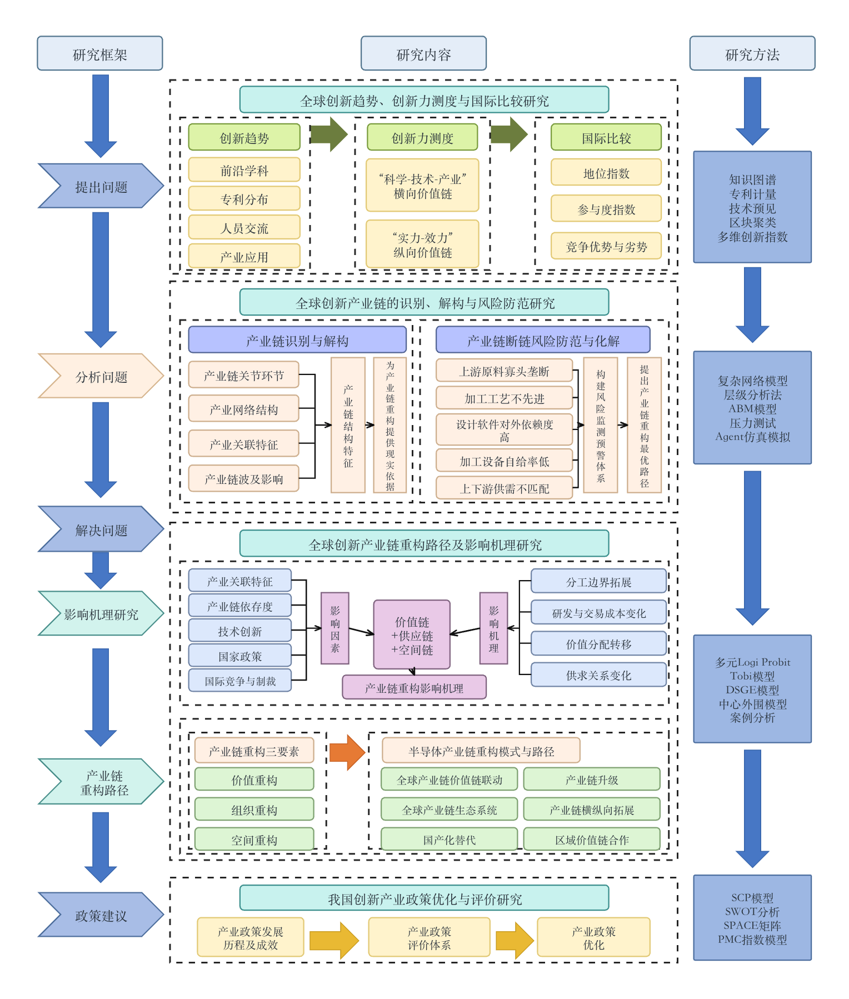
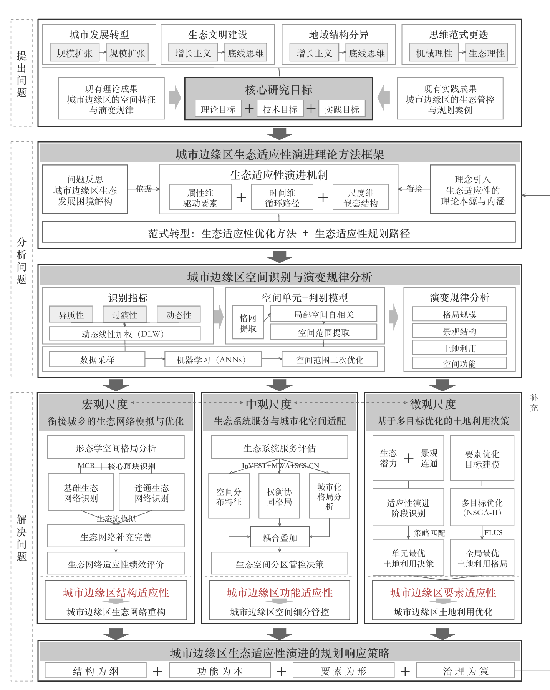
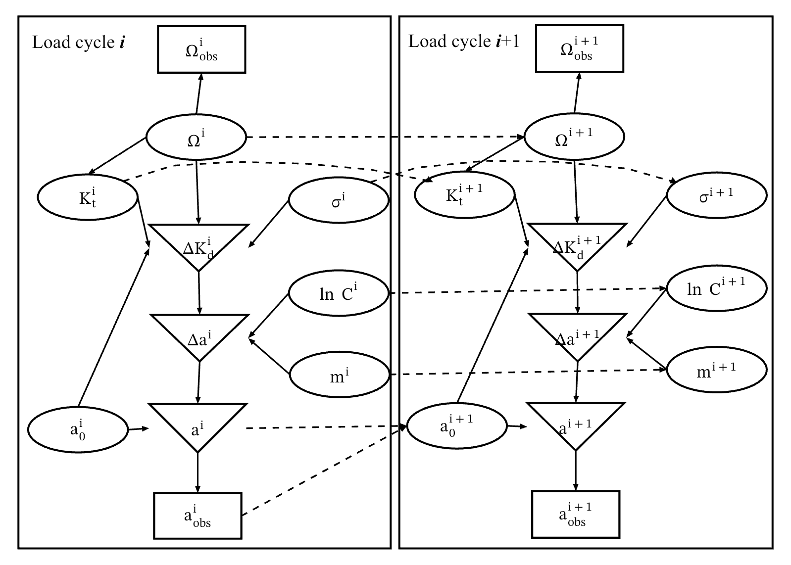
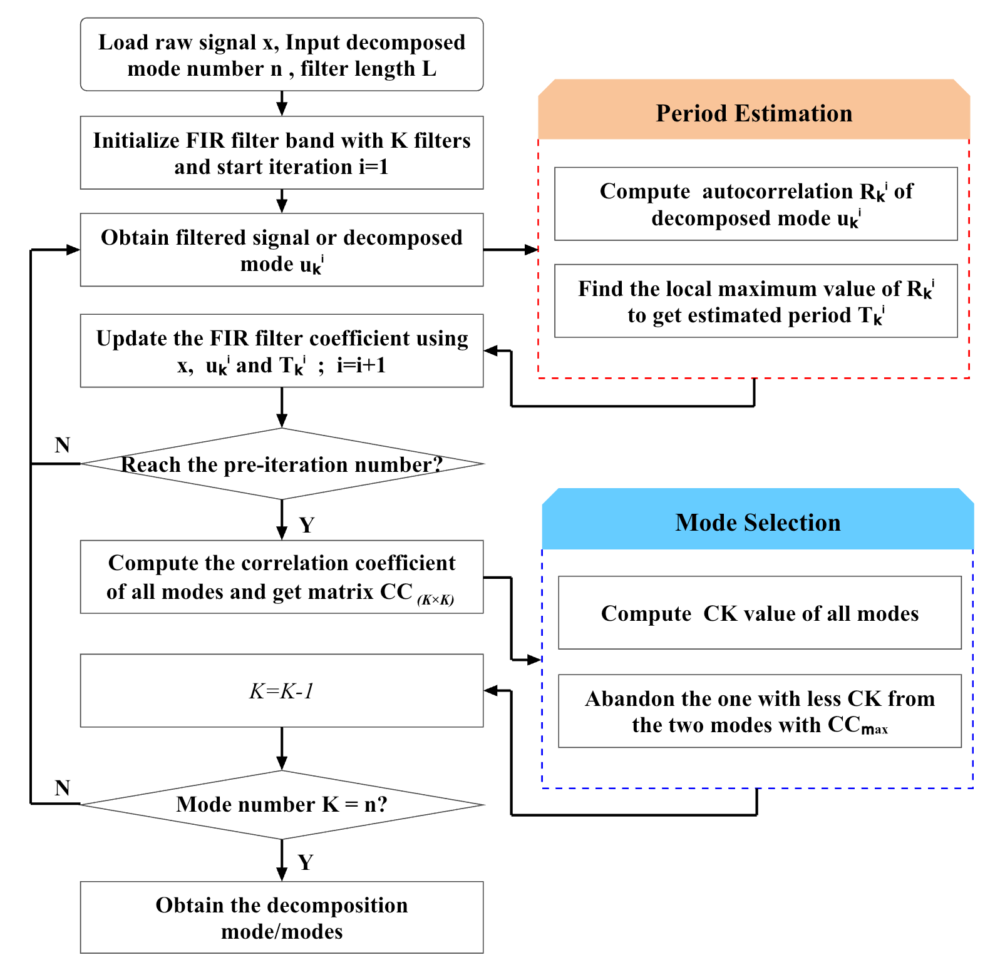

<div align="center">

# SciDiagram PPTX｜科研图示原生复现

**把科研框架图、机制图和流程图，重建为真正可编辑的 PowerPoint 形状、文字、连接线与可替换局部图片。**

研究框架 · 技术路线 · 机制模型 · 算法流程 · 学术图示

[](https://github.com/SciToolsmith/sci-diagram-pptx/actions/workflows/validate.yml) [](LICENSE) [](skills/sci-diagram-pptx/SKILL.md)

[案例](#gallery) · [安装](#install) · [使用](#usage) · [适用边界](#scope) · [English](#english)

</div>

<a id="gallery"></a>

## 真实案例

预览均由可编辑重建页实际渲染。下载 PPTX 后，可以逐个修改文字、形状和连接线。

<table>
  <tr>
    <th width="50%">全球创新产业链研究框架</th>
    <th width="50%">城市边缘区生态适应性机制图</th>
  </tr>
  <tr>
    <td align="center" valign="middle">
      <a href="docs/cases/global-innovation-chain-framework.png">
        
      </a>
    </td>
    <td align="center" valign="middle">
      <a href="docs/cases/urban-fringe-ecological-adaptability-mechanism.png">
        
      </a>
    </td>
  </tr>
  <tr>
    <td align="center">
      <a href="docs/cases/global-innovation-chain-framework.png">查看大图</a> ·
      <a href="https://github.com/SciToolsmith/sci-diagram-pptx/raw/main/examples/cases/global-innovation-chain-framework-editable.pptx">下载 PPTX</a>
    </td>
    <td align="center">
      <a href="docs/cases/urban-fringe-ecological-adaptability-mechanism.png">查看大图</a> ·
      <a href="https://github.com/SciToolsmith/sci-diagram-pptx/raw/main/examples/cases/urban-fringe-ecological-adaptability-mechanism-editable.pptx">下载 PPTX</a>
    </td>
  </tr>
  <tr>
    <th width="50%">载荷循环机制图</th>
    <th width="50%">自适应 FIR 模态分解流程图</th>
  </tr>
  <tr>
    <td align="center" valign="top">
      <a href="docs/cases/load-cycle-model.png">
        
      </a>
    </td>
    <td align="center" valign="middle">
      <a href="docs/cases/adaptive-fir-mode-decomposition.png">
        
      </a>
    </td>
  </tr>
  <tr>
    <td align="center">
      <a href="docs/cases/load-cycle-model.png">查看大图</a> ·
      <a href="https://github.com/SciToolsmith/sci-diagram-pptx/raw/main/examples/cases/load-cycle-model-editable.pptx">下载 PPTX</a>
    </td>
    <td align="center">
      <a href="docs/cases/adaptive-fir-mode-decomposition.png">查看大图</a> ·
      <a href="https://github.com/SciToolsmith/sci-diagram-pptx/raw/main/examples/cases/adaptive-fir-mode-decomposition-flowchart-editable.pptx">下载 PPTX</a>
    </td>
  </tr>
</table>

> 公开案例仅展示和下载单页可编辑 PPTX；实际任务交付中的用户原图与构建源码不随案例公开。

<a id="install"></a>

## 安装

在 Codex 中输入：

```text
请使用 $skill-installer 安装：
https://github.com/SciToolsmith/sci-diagram-pptx/tree/main/skills/sci-diagram-pptx
```

安装后可用 `$sci-diagram-pptx` 显式调用。如果没有立即出现，请重启 Codex。

<details>
<summary>手动安装</summary>

```bash
git clone https://github.com/SciToolsmith/sci-diagram-pptx.git
mkdir -p ~/.codex/skills
cp -R sci-diagram-pptx/skills/sci-diagram-pptx ~/.codex/skills/
```

</details>

<a id="usage"></a>

## 使用

上传参考图后，直接提出目标：

```text
$sci-diagram-pptx 把这张科研流程图忠实重建为原生可编辑 PPTX，
保留文字、公式、层级和连线关系，不要重新设计。
```

也可以要求它修复已有 PPTX、只做结构检查，或明确重建混合图中的某个示意图面板。只检查时不会创建交付文件夹；修复源码若依赖原始 PPTX，会把该输入依赖一并保留。

Skill 对用户保持同一种调用方式。Codex 桌面优先使用内置 Presentations / Artifact Tool；Linux 服务可以由宿主固定设置 `SCI_DIAGRAM_RUNTIME=pptxgenjs`，使用 PptxGenJS 构建并通过 LibreOffice 进行服务器渲染检查。一次任务只使用一个后端，不在生成途中切换。

<a id="scope"></a>

## 适用边界

| 适合 | 不适合 |
| --- | --- |
| 研究框架图、理论框架与技术路线 | 柱状图、折线图、散点图、热图等数据图 |
| 科研流程图、机制图与算法流程图 | 以照片、显微图或实验图像本身为主要交付内容 |
| 科研系统结构图、概念模型 | 普通商业组织图、海报或自由创意设计 |
| 含数学符号或公式的学术图示 | 以坐标轴、尺度和数据几何承载证据的图件 |
| 带局部照片、实验结果或模型截图的混合框架图 | 需要凭低清截图重造关键数据、曲线或实验细节的任务 |
| 已有科研图示 PPTX 的结构修复 | 翻译、论文写作或统计分析本身 |

一个简单判断：含义主要由**节点、标签与连接关系**承载，用本 Skill；含义主要由**坐标轴、尺度与数据**承载，用 [SciPlot](https://github.com/SciToolsmith/sci-plot)。

## 交付原则

常规重建交付一个职责清晰的文件夹：

```text
<图名>_editable/
├── source.<原扩展名>  # 用户上传原图的逐字节副本
├── editable.pptx       # 单页原生可编辑重建
└── build.mjs           # 实际执行的构建源码
```

从上传原图裁出的局部照片或结果图直接嵌入 PPTX，不额外交付裁剪文件。只有用户另外提供、且构建实际依赖的高清或矢量素材，才增加可选 `assets/` 目录。

```text
确认目标 → 梳理结构 → 原生重建 → 渲染 + 结构检查 → 阻断项集中修复一次 → 交付
```

- **单页原生可编辑**：PPTX 只保留重建页，优先使用 PowerPoint 形状、文本框和连接线；照片、实验结果与复杂小图保留为独立、可替换的局部图片，不用整页截图冒充编辑性。
- **方向与拓扑显式**：构建源码明确记录关系的起点、终点、方向、双向性和标签，不依据圆形或环形排布猜测循环。
- **可对照、可执行**：源图保持外置；`build.mjs` 是实际运行并生成该 PPTX 的源码，声明所用后端和版本，不包含本机绝对路径，也不依赖未交付的本地 helper。
- **科学含义优先**：保护文字、公式、方向和拓扑；歧义可能改变含义时先询问用户。
- **聚焦验证**：完成一次全图渲染和一次结构检查；只为明显阻断项集中修复，避免无休止追逐像素微差。
- **跨平台务实**：`editable.pptx` 优先使用稳定的标准形状、独立文本框、明确字体和留白；仅在公式、自定义几何、密集文字等兼容风险存在或用户明确要求时，增加一次真实 PowerPoint 冒烟检查。

[查看完整 Skill 工作流与质量规则](skills/sci-diagram-pptx/SKILL.md)

<details>
<summary><strong>开发与验证</strong></summary>

仓库 CI 检查 Skill 元数据、脚本和确定性结构规则；它不能替代科学含义核验，也不声称不同 PowerPoint 渲染器完全等价。

```bash
python3 -m pip install -r requirements-ci.txt
python3 tests/test_panel_crop.py
python3 tests/test_check.py
```

服务器便携路线另有运行时探测、PptxGenJS 合成构建和 LibreOffice 渲染测试；LibreOffice 通过只代表服务器可打开与导出，不等于所有 PowerPoint 平台像素一致。

欢迎通过 Issues 或 Pull Requests 贡献修复。请勿提交来源不明的论文截图、第三方素材或带本机隐私信息的文件。

</details>

## 许可与声明

代码以 [Apache License 2.0](LICENSE) 发布。用户应确认输入素材的使用权，并在交付前核验文字、公式、箭头方向与科学含义。

SciDiagram PPTX 是独立社区项目，与 OpenAI、Microsoft、Nature、Springer Nature 或任何期刊不存在官方隶属关系。

<a id="english"></a>

<details>
<summary><strong>English quick start</strong></summary>

### What it does

SciDiagram PPTX reconstructs scientific frameworks, mechanism diagrams, and research flowcharts as native editable PowerPoint shapes, text, connectors, and replaceable local image insets. It preserves content and explicit edge direction instead of redesigning the source or hiding it behind a full-slide bitmap.

For charts whose evidence is encoded by axes, scales, and data-driven geometry, use [SciPlot](https://github.com/SciToolsmith/sci-plot) instead.

### Install

```text
Use $skill-installer to install:
https://github.com/SciToolsmith/sci-diagram-pptx/tree/main/skills/sci-diagram-pptx
```

### Invoke

```text
$sci-diagram-pptx Reconstruct this scientific flowchart as a native editable PPTX.
Preserve all labels, formulas, hierarchy, directions, and connections. Do not redesign it.
```

### Delivery

Each reconstruction is returned as one folder containing the unchanged uploaded source, a single-slide native editable `editable.pptx`, and the actual `build.mjs` used to generate it. Crops taken from the upload are embedded as replaceable picture objects and do not add separate delivery files. Independently supplied high-resolution assets are included only when the build requires them.

### Editable examples

- [Global innovation-chain framework](https://github.com/SciToolsmith/sci-diagram-pptx/raw/main/examples/cases/global-innovation-chain-framework-editable.pptx)
- [Urban-fringe ecological adaptability mechanism](https://github.com/SciToolsmith/sci-diagram-pptx/raw/main/examples/cases/urban-fringe-ecological-adaptability-mechanism-editable.pptx)
- [Load-cycle mechanism](https://github.com/SciToolsmith/sci-diagram-pptx/raw/main/examples/cases/load-cycle-model-editable.pptx)
- [Adaptive FIR decomposition flowchart](https://github.com/SciToolsmith/sci-diagram-pptx/raw/main/examples/cases/adaptive-fir-mode-decomposition-flowchart-editable.pptx)

Public examples expose only the single-slide editable PPTX. User source images and task build files are not published with them.

</details>
