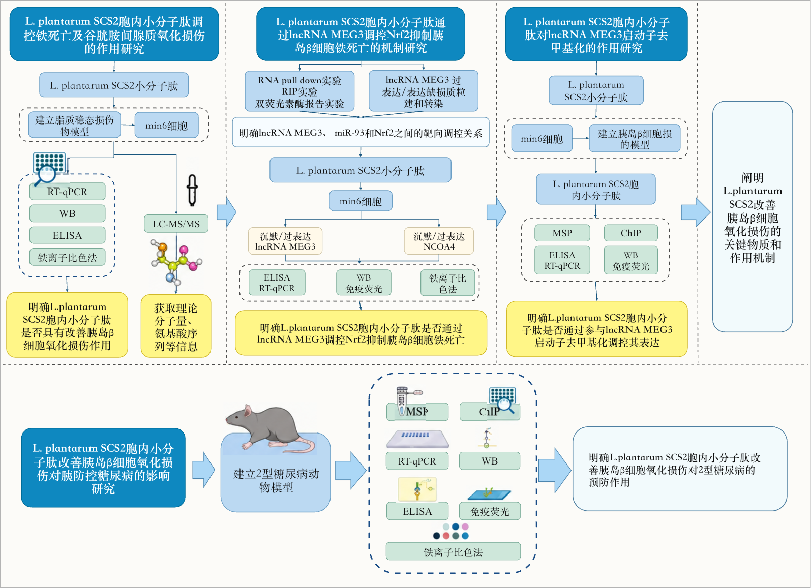
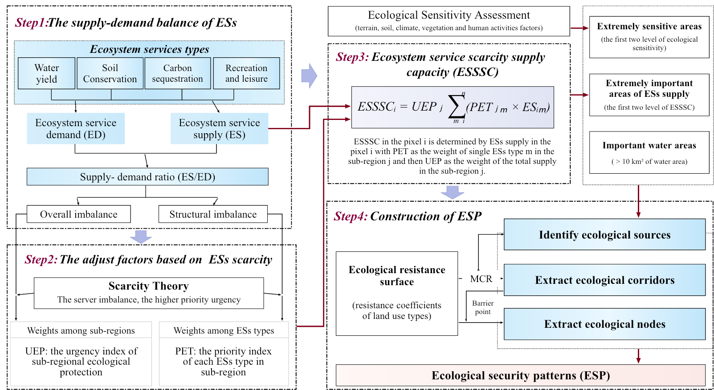
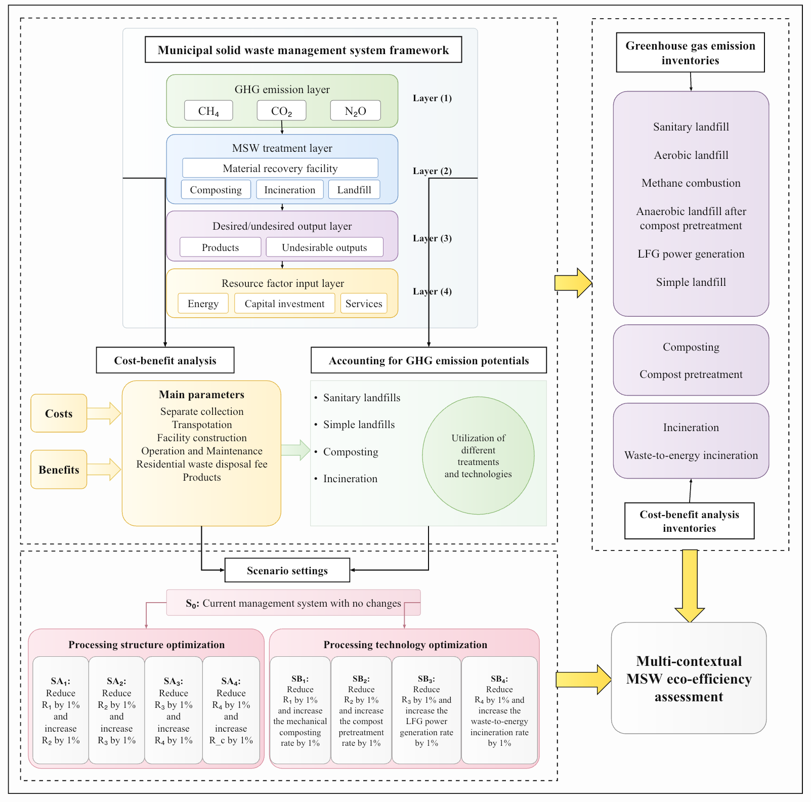
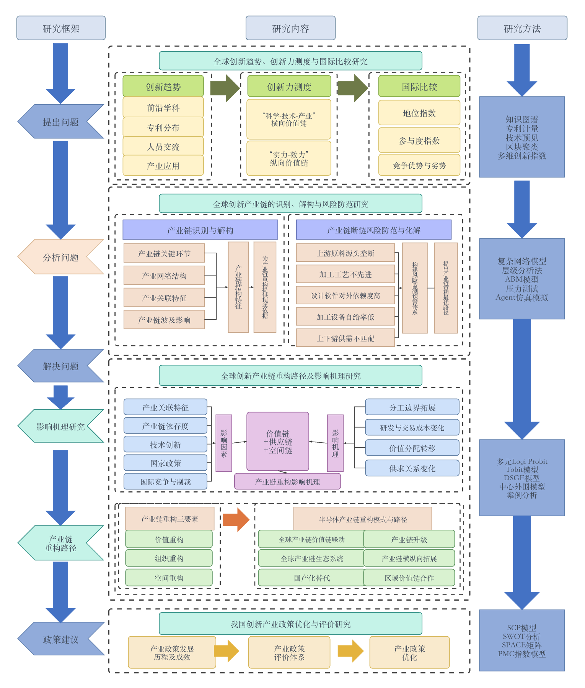
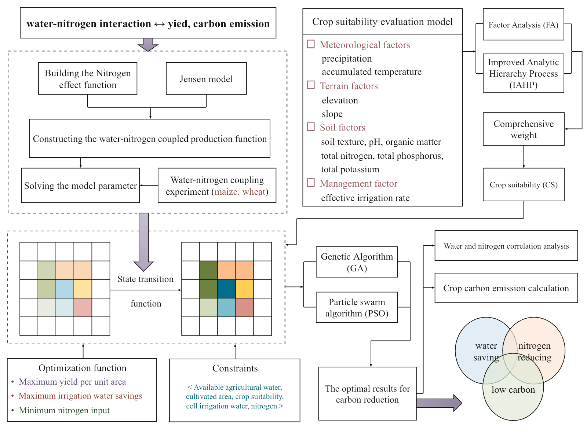
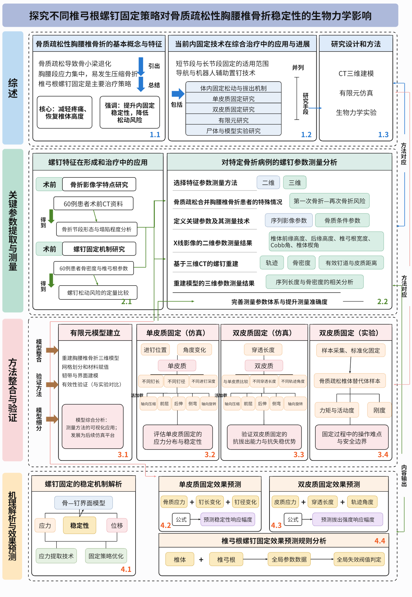

<div align="center">

# SciDiagram PPTX

### 科研图示原生复现

把科研框架图、机制图和流程图，重建为真正可编辑的 PowerPoint 形状、文字、连接线与可替换局部图片。

[](https://github.com/SciToolsmith/sci-diagram-pptx/actions/workflows/validate.yml)
[](LICENSE)
[](skills/sci-diagram-pptx/SKILL.md)

[查看真实案例](#cases) · [快速开始](#quick-start) · [交付内容](#delivery) · [适用边界](#scope) · [English](#english)

</div>

<p align="center">
  
</p>

> **它不做什么？** 不用整页截图冒充可编辑，不擅自重新设计论文图，也不为了像素微差无限返工。

SciDiagram PPTX 面向含义主要由**节点、标签、公式、层级和连接关系**承载的科研图示。它保留科学内容和拓扑，把照片、显微图、实验结果等复杂区域作为独立、可替换的局部图片对象，并交付实际执行的构建源码。

<a id="cases"></a>

## 真实案例

以下预览都来自仓库中对应的 `editable.pptx` 实际渲染，不是为了 README 重新制作的效果图。每个案例都公开参考原图、可编辑 PPTX 和实际执行的 `build.mjs`。

### 精选案例

<p align="center">
  <a href="docs/cases/l-plantarum-scs2-islet-cell-injury-mechanism.png" title="01 · 生物医学机制图">
    
  </a>
  &nbsp;
  <a href="docs/cases/ecosystem-services-assessment.png" title="02 · 生态系统服务评估流程">
    
  </a>
</p>

#### 01 · 生物医学机制图

多研究模块、多级路径、中文术语与实验素材并存；原生节点和连接线保持可编辑，复杂实验素材保留为可替换的局部图片。

[参考原图](examples/cases/l-plantarum-scs2-islet-cell-injury-mechanism/source.png) ·
[下载 editable.pptx](https://github.com/SciToolsmith/sci-diagram-pptx/raw/main/examples/cases/l-plantarum-scs2-islet-cell-injury-mechanism/editable.pptx) ·
[查看 build.mjs](examples/cases/l-plantarum-scs2-islet-cell-injury-mechanism/build.mjs)

#### 02 · 生态系统服务评估流程

流程、公式、分支和方向共同承载含义；重建保留步骤层级、箭头拓扑和公式区域，不把复杂页面压成一张图片。

[参考原图](examples/cases/ecosystem-services-assessment/source.png) ·
[下载 editable.pptx](https://github.com/SciToolsmith/sci-diagram-pptx/raw/main/examples/cases/ecosystem-services-assessment/editable.pptx) ·
[查看 build.mjs](examples/cases/ecosystem-services-assessment/build.mjs)

<details>
<summary><strong>展开另外 4 个可复现案例</strong></summary>

<p align="center">
  <a href="docs/cases/municipal-solid-waste-ghg-accounting-framework.png" title="03 · 城市固废与温室气体核算框架">
    
  </a>
  &nbsp;
  <a href="docs/cases/global-innovation-industry-chain.png" title="04 · 全球创新产业链研究框架">
    
  </a>
</p>

**03 · 城市固废与温室气体核算框架** —
[原图](examples/cases/municipal-solid-waste-ghg-accounting-framework/source.png) ·
[PPTX](https://github.com/SciToolsmith/sci-diagram-pptx/raw/main/examples/cases/municipal-solid-waste-ghg-accounting-framework/editable.pptx) ·
[源码](examples/cases/municipal-solid-waste-ghg-accounting-framework/build.mjs)

**04 · 全球创新产业链研究框架** —
[原图](examples/cases/global-innovation-industry-chain/source.png) ·
[PPTX](https://github.com/SciToolsmith/sci-diagram-pptx/raw/main/examples/cases/global-innovation-industry-chain/editable.pptx) ·
[源码](examples/cases/global-innovation-industry-chain/build.mjs)

<p align="center">
  <a href="docs/cases/water-nitrogen-low-carbon-optimization.png" title="05 · 水氮互作与作物低碳优化">
    
  </a>
  &nbsp;
  <a href="docs/cases/osteoporosis-pedicle-screw-biomechanics.png" title="06 · 骨质疏松椎弓根螺钉生物力学">
    
  </a>
</p>

**05 · 水氮互作与作物低碳优化** —
[原图](examples/cases/water-nitrogen-low-carbon-optimization/source.png) ·
[PPTX](https://github.com/SciToolsmith/sci-diagram-pptx/raw/main/examples/cases/water-nitrogen-low-carbon-optimization/editable.pptx) ·
[源码](examples/cases/water-nitrogen-low-carbon-optimization/build.mjs)

**06 · 骨质疏松椎弓根螺钉生物力学** —
[原图](examples/cases/osteoporosis-pedicle-screw-biomechanics/source.png) ·
[PPTX](https://github.com/SciToolsmith/sci-diagram-pptx/raw/main/examples/cases/osteoporosis-pedicle-screw-biomechanics/editable.pptx) ·
[源码](examples/cases/osteoporosis-pedicle-screw-biomechanics/build.mjs)

</details>

<a id="quick-start"></a>

## 快速开始

### 1. 安装

在 Codex 中输入：

```text
请使用 $skill-installer 安装：
https://github.com/SciToolsmith/sci-diagram-pptx/tree/main/skills/sci-diagram-pptx
```

安装后可用 `$sci-diagram-pptx` 显式调用。如果 Skill 没有立即出现，请重启 Codex。

### 2. 上传图片并提出目标

```text
$sci-diagram-pptx 把这张科研流程图忠实重建为原生可编辑 PPTX。
保留文字、公式、层级和连线关系，不要重新设计。
```

你也可以直接指定另外两种路径：

- **修复**：“修复这个 PPTX 的第 3 页，其他页面保持不变。”
- **检查**：“只检查这个 PPTX 的第 3 页，不要修改。”

<a id="delivery"></a>

## 交付内容

常规重建默认返回一个职责清晰的文件夹：

```text
<图名>_editable/
├── source.<原扩展名>  # 上传原图的逐字节副本
├── editable.pptx       # 单页原生可编辑重建
└── build.mjs           # 实际执行的构建源码
```

- **原生可编辑**：标题、标签、形状和连接线可在 PowerPoint 中继续修改。
- **局部图片可替换**：照片、显微图、实验结果和复杂小图保留为独立图片对象，不使用整页截图。
- **构建可追溯**：`build.mjs` 明确记录对象、方向、层级和运行环境。
- **交付保持简洁**：内部渲染、检查报告、缓存和临时裁剪不会塞进用户文件夹。

质量检查采用有边界的两轮流程：

```text
识别内容与拓扑
        ↓
pass-01：构建 → 渲染 + 结构检查
        ↓
仅在存在明确阻断项时，集中修正一次
        ↓
pass-02：终检 → 交付或说明剩余阻断
```

普通警告、抗锯齿、轻微字距和像素差异不会自动开启新一轮。默认验收边界是可移植构建、正常渲染和结构检查，不要求把本机 PowerPoint UI 打开作为额外步骤。

<a id="scope"></a>

## 适用边界

**适合使用**

- 研究框架、理论框架和技术路线
- 科研流程、机制图、算法流程和系统结构
- 含数学符号、公式或复杂层级的学术图示
- 带少量照片、实验结果或模型截图的混合框架图
- 已有科研图示 PPTX 的指定页面修复或检查

**不适合使用**

- 柱状图、折线图、散点图、热图等定量数据图
- 以坐标轴、尺度和数据几何承载主要证据的图件
- 需要从低清截图重新制造关键实验数据或曲线的任务
- 普通商业演示、海报、组织架构或自由创意设计
- 论文写作、翻译和统计分析本身

一个简单判断：含义主要由**节点、标签与连接关系**承载，用本 Skill；含义主要由**坐标轴、尺度与数据**承载，用 [SciPlot](https://github.com/SciToolsmith/sci-plot)。

## 设计原则

- **忠实优先于重新设计**：保护文字、公式、方向、层级和科学含义。
- **一个元素只有一个所有者**：同一文字或箭头只由原生对象或局部图片中的一方负责。
- **拓扑显式**：构建源码记录关系起点、终点、方向、双向性和标签，不根据视觉排布猜测循环。
- **务实处理不确定性**：读不清且可能改变含义时才询问；外观小差异采用合理近似。
- **拒绝无限返工**：首轮后最多进行一次集中修正，第二轮必须收口。

[查看完整 Skill 工作流与质量规则](skills/sci-diagram-pptx/SKILL.md)

<details>
<summary><strong>Linux / PptxGenJS 宿主配置</strong></summary>

便携路线要求 Node.js 20+、PptxGenJS 4.0.x、Python 3.10+、LibreOffice 和 `pdftoppm`。当前用于标准形状、文字、连接线和局部图片的 Reconstruction，不宣称能够导入并保留现有多页 PPTX。

```bash
sudo apt-get update
sudo apt-get install -y --no-install-recommends \
  libreoffice-impress poppler-utils fonts-noto-cjk fonts-noto-core fonts-liberation
python3 -m pip install -r requirements-ci.txt
npm ci --ignore-scripts --no-audit --no-fund
SCI_DIAGRAM_RUNTIME=pptxgenjs \
  node skills/sci-diagram-pptx/scripts/probe_runtime.mjs \
    --runtime pptxgenjs --task-dir "$PWD"
python3 -B tests/test_portable_runtime.py
```

`$skill-installer` 只安装 Skill，不替宿主安装系统或 Node 依赖。生产宿主应提前固定依赖，并把生成的 `build.mjs` 视为不受信任的任务代码，在隔离环境中限制网络、进程、时间、内存和文件系统访问。

</details>

<details>
<summary><strong>开发与验证</strong></summary>

```bash
python3 -m pip install -r requirements-ci.txt
python3 -B tests/test_panel_crop.py
python3 -B tests/test_check.py
npm ci --ignore-scripts --no-audit --no-fund
python3 -B tests/test_portable_runtime.py
```

CI 检查 Skill 元数据、脚本、示例包和确定性结构规则。LibreOffice 通过只代表服务器能够打开与导出，不代表所有 PowerPoint 平台像素一致。

</details>

## 许可与声明

仓库代码以 [Apache License 2.0](LICENSE) 发布。示例参考图若包含第三方内容，其权利仍以原始来源为准；用户应确认输入素材的使用权，并在交付前核验文字、公式、箭头方向与科学含义。

SciDiagram PPTX 是独立社区项目，与 OpenAI、Microsoft、Nature、Springer Nature 或任何期刊不存在官方隶属关系。

<a id="english"></a>

<details>
<summary><strong>English quick start</strong></summary>

### What it does

SciDiagram PPTX reconstructs scientific frameworks, mechanism diagrams, and research flowcharts as native editable PowerPoint shapes, text, connectors, and replaceable local image insets. It preserves content and explicit topology instead of redesigning the source or hiding it behind a full-slide bitmap.

For charts whose evidence is encoded by axes, scales, and data-driven geometry, use [SciPlot](https://github.com/SciToolsmith/sci-plot).

### Install

```text
Use $skill-installer to install:
https://github.com/SciToolsmith/sci-diagram-pptx/tree/main/skills/sci-diagram-pptx
```

### Invoke

```text
$sci-diagram-pptx Reconstruct this scientific flowchart as a native editable PPTX.
Preserve all labels, formulas, hierarchy, directions, and connections. Do not redesign it.
```

### Delivery

Each reconstruction returns the unchanged source, a single-slide native editable `editable.pptx`, and the executed `build.mjs`. The first authored pass may be followed by at most one grouped correction; warnings alone do not trigger another pass.

### Reproducible examples

- [Biomedical mechanism diagram](examples/cases/l-plantarum-scs2-islet-cell-injury-mechanism/)
- [Ecosystem-services assessment workflow](examples/cases/ecosystem-services-assessment/)
- [Municipal solid-waste and GHG accounting framework](examples/cases/municipal-solid-waste-ghg-accounting-framework/)
- [Global innovation industry-chain framework](examples/cases/global-innovation-industry-chain/)
- [Water–nitrogen low-carbon crop optimization](examples/cases/water-nitrogen-low-carbon-optimization/)
- [Osteoporosis pedicle-screw biomechanics workflow](examples/cases/osteoporosis-pedicle-screw-biomechanics/)

</details>
